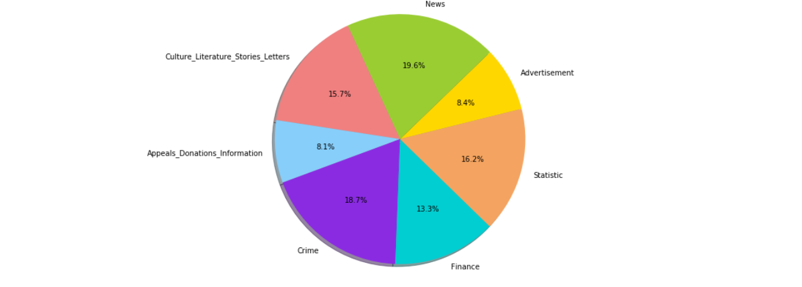

# NLP-Notebooks-Newspaper-Collections
A collection of notebooks for Natural Language Processing

<h3><a href="## Text classification for topic-specific newspaper collections</a></h3>
   
## Text classification for topic-specific newspaper collections

<a href="https://github.com/NewsEye/NLP-Notebooks-Newspaper-Collections/blob/master/Text_classification_of_newspaper_clippings_notebook.ipynb" target="_blank">Go to notebook</a> 

Text classification is the process of categorizing text into pre-defined groups. By using Natural Language Processing (NLP), text classifiers can automatically analyze text and then assign a set of given categories based on the research question. This automated classification of text into predefined categories is an important method for managing and processing a large number of newspaper clippings. This also applies to subcorpora for a specific research topic (e.g. migration). The aim of this notebook is to train a model using your previously manually created training/test corpus and to use this model to get an overview of the category distribution throughout your collection (see figure below). Another goal is to export your categorized data for further analysis. This makes it possible to examine, for example, the advertisement about a specific topic.

This notebook was used with a collection for the case study on emigration and shows how a model can be trained to classify topic-specific collections. For the training/testing corpus, a collection with the keywords "Auswander*", "Ausgewanderte", "Emigrant*", "Emigrierte", "Emigration", "Kolonist*", and "Ansiedler*" (all different German words for emigrants or emigration) have been created. In addition, information on the pre-defined gropus (news, ads, culture...) were added using numbers between one and ten. 
For classification, topic modelling (LDA) was chosen because it showed the best performance in classification (after experiments with word embeddings or LDA and word embeddings combined). LDA provides a way to group documents by topic and perform similarity searches and improve precision. Thanks to sklearn, it is relatively easy to test different classifiers for a given topic classification task. Logistic regression was chosen as binary classifier. 

*Output graph using an unseen collection on the topic of emigration  (790 newspaper clippings).* 

## Using LDA and Jensen-Shannon Distance (JSD) to group similar newspaper articles
<a href="https://github.com/NewsEye/NLP-Notebooks-Newspaper-Collections/blob/master/news_article_similarity_notebook.ipynb" target="_blank">Go to notebook</a>

Many researchers have the problem that their data sets or automated set annotations contain articles that are irrelevant to their research question. For example, if the goal is to find newspaper articles or "news items" on return migration, researchers have to deal with some ambiguous search terms. The German words "Heimkehr" (returning home) or "Rückkehr" (returning back) lead to many articles that are relevant to the research question, but also to articles that are not relevant (e.g. return from a mountain tour, work, etc.). By using topic models and document similarity measurements, this notebook allows me to exclude these articles without combining the word "Heimkehr" with other search terms. Furthermore, the same code can also be used to remove or prefer a certain genre, e.g. advertising, sports news, etc.

To give another example: If I want to create a collection of articles about the disease cancer, one of the important German words for cancer is "Krebs". But "Krebs" in German is also a common surname, an animal (crab) or a sign of the zodiac.
The main purpose of this notebook is to take into account the context of articles in order to automatically refine a search query. This means that even ambiguous words can be used for the search without having to combine them with other words, making the search less influenced by the researcher's prior knowledge and avoiding a too narrow tunnel vision.

So how is this working?

Given a manually annotated collection of articles containing relevant as well as non relevant articles, this program will get the topic distribution of each document using LDA (gensim library). These topic distributions serve as a comparison for other, unseen articles, in order to automatically distinguish between relevant and non-relevant articles. The annotations are used for evaluation and counting the relevance probability for an unseen article.

For the comparison, the Jensen-Shannon distance method is used to measure the similarity between the topic distribution of an unseen article and the topic distribution of the training corpus. Therefore, the topic distribution of each new article will be compared to the topic distribution of the articles in the trained corpus. Then, for each unseen article, the 10 most similar articles from the training corpus are being extracted. These articles carry the information about the manually assigned relevancy. If 60 precent of the automatically found similar articles were annotated as relevant, the new article will be marked as relevant. Otherwise it will be marked as irrelevant. Using two different datasets (one about cancer and one about return migration), the average score of correct selected articles is between 80 and 90 percent.

